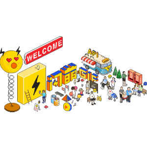

# 🌐 Icons 高清网站图标库

个人精心收集与整理的高清网站图标库（Web Favicons & Logos）。  
通过 **GitHub Pages** 与 **jsDelivr CDN** 全球分发，专为新标签页快捷方式、博客导航、个人主页及书签工具提供无跨域限制（CORS-free）的高清直链。

🌐 **在线图库导航**：[https://o-ocn.github.io/icons/](https://o-ocn.github.io/icons/)

---

## ⚡ CDN 直链调用方式

每个图标均提供两种公网直链访问方式：

1. **GitHub Pages 直链**（海外及国际网络首选，永远同步最新仓库）：
   ```text
   https://o-ocn.github.io/icons/icons/{filename}
   ```
2. **jsDelivr CDN 直链**（国内访问更稳定，全球边缘节点缓存）：
   ```text
   https://cdn.jsdelivr.net/gh/o-ocn/icons@main/icons/{filename}
   ```

---

## 📋 图标总览与备注表

| 预览 | 名称 | 分辨率 / 格式 | 官方网址 | Pages 直链 | jsDelivr CDN 直链 | 备注说明 |
| :---: | :---: | :---: | :---: | :---: | :---: | :---: |
|  | **VMISS** | 512×512 `PNG` | [app.vmiss.com](https://app.vmiss.com/) | [🔗 直链](https://o-ocn.github.io/icons/icons/vmiss.png) | [⚡ CDN](https://cdn.jsdelivr.net/gh/o-ocn/icons@main/icons/vmiss.png) | VMISS 官方标志 Logo |
|  | **ChatGPT** | Vector `SVG` | [chatgpt.com](https://chatgpt.com/) | [🔗 直链](https://o-ocn.github.io/icons/icons/chatgpt.svg) | [⚡ CDN](https://cdn.jsdelivr.net/gh/o-ocn/icons@main/icons/chatgpt.svg) | OpenAI ChatGPT 官方矢量标志 |
|  | **DeepSeek** | Vector `SVG` | [chat.deepseek.com](https://chat.deepseek.com/) | [🔗 直链](https://o-ocn.github.io/icons/icons/deepseek.svg) | [⚡ CDN](https://cdn.jsdelivr.net/gh/o-ocn/icons@main/icons/deepseek.svg) | DeepSeek 深度求索官方蓝鲸标志 |
|  | **Grok** | Vector `SVG` | [grok.com](https://grok.com/) | [🔗 直链](https://o-ocn.github.io/icons/icons/grok.svg) | [⚡ CDN](https://cdn.jsdelivr.net/gh/o-ocn/icons@main/icons/grok.svg) | xAI Grok 官方矢量标志 |
|  | **OneDrive** | Vector `SVG` | [onedrive.live.com](https://onedrive.live.com/) | [🔗 直链](https://o-ocn.github.io/icons/icons/onedrive.svg) | [⚡ CDN](https://cdn.jsdelivr.net/gh/o-ocn/icons@main/icons/onedrive.svg) | Microsoft OneDrive 官方最新云朵图标 |
|  | **Google Drive** | Vector `SVG` | [drive.google.com](https://drive.google.com/) | [🔗 直链](https://o-ocn.github.io/icons/icons/googledrive.svg) | [⚡ CDN](https://cdn.jsdelivr.net/gh/o-ocn/icons@main/icons/googledrive.svg) | Google Drive 官方彩色三角形标志 |
|  | **X** | Vector `SVG` | [x.com](https://x.com/) | [🔗 直链](https://o-ocn.github.io/icons/icons/x.svg) | [⚡ CDN](https://cdn.jsdelivr.net/gh/o-ocn/icons@main/icons/x.svg) | X (原 Twitter) 官方矢量标志 |
|  | **Instagram** | Vector `SVG` | [instagram.com](https://www.instagram.com/) | [🔗 直链](https://o-ocn.github.io/icons/icons/instagram.svg) | [⚡ CDN](https://cdn.jsdelivr.net/gh/o-ocn/icons@main/icons/instagram.svg) | Instagram 官方渐变相机图标 |
|  | **Reddit** | Vector `SVG` | [reddit.com](https://www.reddit.com/) | [🔗 直链](https://o-ocn.github.io/icons/icons/reddit.svg) | [⚡ CDN](https://cdn.jsdelivr.net/gh/o-ocn/icons@main/icons/reddit.svg) | Reddit 官方橙色 Snoo 标志 |
|  | **Twitch** | Vector `SVG` | [twitch.tv](https://www.twitch.tv/) | [🔗 直链](https://o-ocn.github.io/icons/icons/twitch.svg) | [⚡ CDN](https://cdn.jsdelivr.net/gh/o-ocn/icons@main/icons/twitch.svg) | Twitch 官方紫色对话框标志 |
|  | **LocalSend** | 512×512 `PNG` | [web.localsend.org](https://web.localsend.org/zh-CN) | [🔗 直链](https://o-ocn.github.io/icons/icons/localsend.png) | [⚡ CDN](https://cdn.jsdelivr.net/gh/o-ocn/icons@main/icons/localsend.png) | LocalSend 官方 512x512 高清标志 |
|  | **Oopz** | 128×128 `PNG` | [web.oopz.cn](https://web.oopz.cn/) | [🔗 直链](https://o-ocn.github.io/icons/icons/oopz.png) | [⚡ CDN](https://cdn.jsdelivr.net/gh/o-ocn/icons@main/icons/oopz.png) | Oopz 官方语音开黑标志 |
|  | **抖音** | Vector `SVG` | [douyin.com](https://www.douyin.com/) | [🔗 直链](https://o-ocn.github.io/icons/icons/douyin.svg) | [⚡ CDN](https://cdn.jsdelivr.net/gh/o-ocn/icons@main/icons/douyin.svg) | 抖音官方音符矢量标志 |
|  | **百度贴吧** | Vector `SVG` | [tieba.baidu.com](https://tieba.baidu.com/) | [🔗 直链](https://o-ocn.github.io/icons/icons/tieba.svg) | [⚡ CDN](https://cdn.jsdelivr.net/gh/o-ocn/icons@main/icons/tieba.svg) | 百度贴吧官方矢量标志 |
|  | **阡陌居** | 128×128 `PNG` | [1000qm.vip](http://www.1000qm.vip/) | [🔗 直链](https://o-ocn.github.io/icons/icons/qianmo.png) | [⚡ CDN](https://cdn.jsdelivr.net/gh/o-ocn/icons@main/icons/qianmo.png) | 阡陌居论坛专属可爱猫猫头像 |
|  | **搜书吧** | 128×128 `PNG` | 搜书吧官网 | [🔗 直链](https://o-ocn.github.io/icons/icons/soushuba.png) | [⚡ CDN](https://cdn.jsdelivr.net/gh/o-ocn/icons@main/icons/soushuba.png) | 搜书吧专属可爱小猫头像（略——！！） |
|  | **网易邮箱** | 128×128 `PNG` | [email.163.com](https://email.163.com/) | [🔗 直链](https://o-ocn.github.io/icons/icons/netease.png) | [⚡ CDN](https://cdn.jsdelivr.net/gh/o-ocn/icons@main/icons/netease.png) | 网易 163 邮箱官方标志 |
|  | **3DM论坛** | 128×128 `PNG` | [bbs.3dmgame.com](https://bbs.3dmgame.com/forum.php) | [🔗 直链](https://o-ocn.github.io/icons/icons/threedm.png) | [⚡ CDN](https://cdn.jsdelivr.net/gh/o-ocn/icons@main/icons/threedm.png) | 3DM 游戏论坛官方标志 |
|  | **发表情** | 128×128 `PNG` | [fabiaoqing.com](https://fabiaoqing.com/) | [🔗 直链](https://o-ocn.github.io/icons/icons/fabiaoqing.png) | [⚡ CDN](https://cdn.jsdelivr.net/gh/o-ocn/icons@main/icons/fabiaoqing.png) | 发表情网官方标志 |
|  | **闪萌** | 128×128 `PNG` | [weshineapp.com](https://www.weshineapp.com/) | [🔗 直链](https://o-ocn.github.io/icons/icons/weshine.png) | [⚡ CDN](https://cdn.jsdelivr.net/gh/o-ocn/icons@main/icons/weshine.png) | 闪萌表情官方闪电标志 |
|  | **斗图啦** | 64×64 `ICO` | [doutupk.com](https://www.doutupk.com/) | [🔗 直链](https://o-ocn.github.io/icons/icons/pkdoutu.ico) | [⚡ CDN](https://cdn.jsdelivr.net/gh/o-ocn/icons@main/icons/pkdoutu.ico) | 斗图啦官方标志 |
|  | **默认备用图标** | 1024×1024 `PNG` | [icons](https://o-ocn.github.io/icons/) | [🔗 直链](https://o-ocn.github.io/icons/icons/default-fallback.png) | [⚡ CDN](https://cdn.jsdelivr.net/gh/o-ocn/icons@main/icons/default-fallback.png) | 自动获取失败时的默认备用可爱猫猫图标（略——！！） |

---

## 🛠️ 如何添加新图标

1. 将图标文件放入 `icons/` 目录；
2. 在 `data/icons.json` 中添加该图标的条目元数据；
3. 更新 `README.md` 表格；
4. 运行 `git commit` 并 `git push` 到 `main` 分支，GitHub Pages 将在 30 秒内自动生效！
