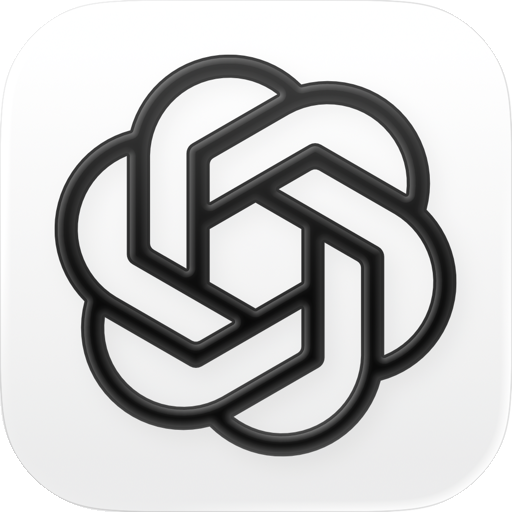
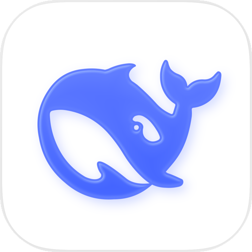
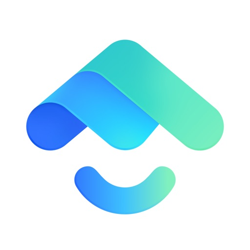
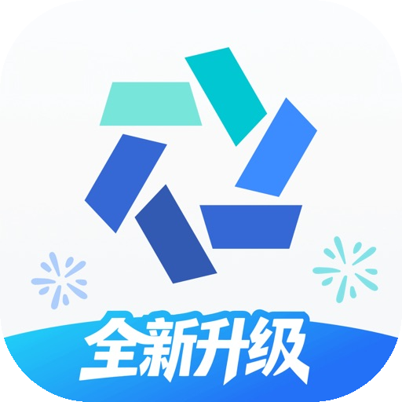
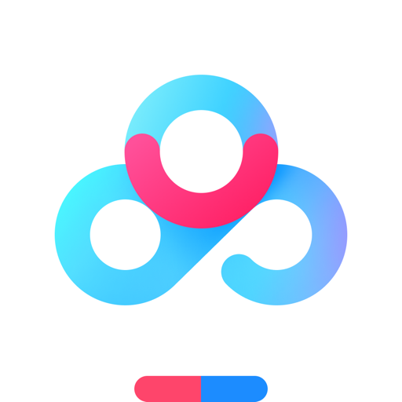
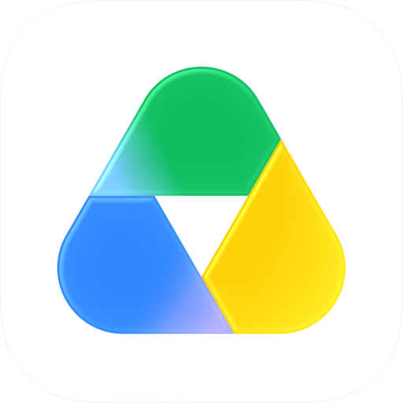
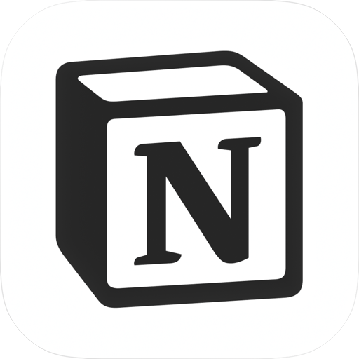
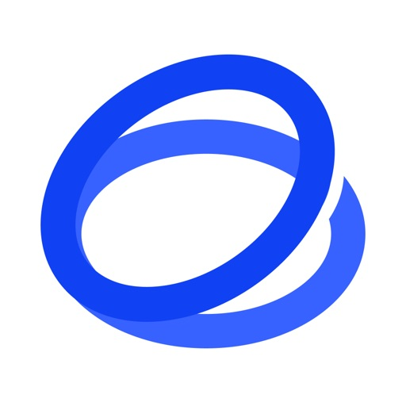
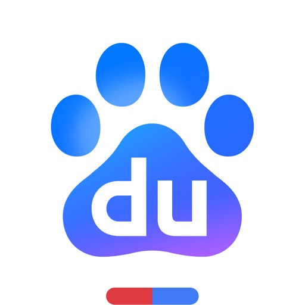

# 🌐 Icons 高清网站图标库

个人精心收集与整理的高清网站图标库（Web Favicons & Logos）。  
通过 **GitHub Pages** 与 **jsDelivr CDN** 全球分发，专为新标签页快捷方式、博客导航、个人主页及书签工具提供无跨域限制（CORS-free）的高清直链。

🌐 **在线图库导航**：[https://o-ocn.github.io/icons/](https://o-ocn.github.io/icons/)

---

## ⚡ CDN 直链调用方式

每个图标均提供两种公网直链访问方式：

1. **GitHub Pages 直链**（海外及国际网络首选，永远同步最新仓库）：
   ```text
   https://o-ocn.github.io/icons/icons/{filename}
   ```
2. **jsDelivr CDN 直链**（国内访问更稳定，全球边缘节点缓存）：
   ```text
   https://cdn.jsdelivr.net/gh/o-ocn/icons@main/icons/{filename}
   ```

---

## 📋 图标总览与备注表

| 预览 | 名称 | 分辨率 / 格式 | 官方网址 | Pages 直链 | jsDelivr CDN 直链 | 备注说明 |
| :---: | :---: | :---: | :---: | :---: | :---: | :---: |
|  | **VMISS** | 512x512 `PNG` | [app.vmiss.com](https://app.vmiss.com/) | [🔗 直链](https://o-ocn.github.io/icons/icons/vmiss.png) | [⚡ CDN](https://cdn.jsdelivr.net/gh/o-ocn/icons@main/icons/vmiss.png) | VMISS 官方标志 Logo |
|  | **ChatGPT** | 512x512 `PNG` | [chatgpt.com](https://chatgpt.com/) | [🔗 直链](https://o-ocn.github.io/icons/icons/chatgpt.png) | [⚡ CDN](https://cdn.jsdelivr.net/gh/o-ocn/icons@main/icons/chatgpt.png) | OpenAI ChatGPT 官方 App Store 图标（白底圆角） |
|  | **DeepSeek** | 512x512 `PNG` | [chat.deepseek.com](https://chat.deepseek.com/) | [🔗 直链](https://o-ocn.github.io/icons/icons/deepseek.png) | [⚡ CDN](https://cdn.jsdelivr.net/gh/o-ocn/icons@main/icons/deepseek.png) | DeepSeek 深度求索官方 App Store 图标（白底蓝鲸圆角） |
|  | **Grok** | 512x512 `PNG` | [grok.com](https://grok.com/) | [🔗 直链](https://o-ocn.github.io/icons/icons/grok.png) | [⚡ CDN](https://cdn.jsdelivr.net/gh/o-ocn/icons@main/icons/grok.png) | xAI Grok 官方 App Store 图标（黑底斜杠圆角） |
|  | **OneDrive** | 512x512 `PNG` | [onedrive.live.com](https://onedrive.live.com/) | [🔗 直链](https://o-ocn.github.io/icons/icons/onedrive.png) | [⚡ CDN](https://cdn.jsdelivr.net/gh/o-ocn/icons@main/icons/onedrive.png) | Microsoft OneDrive 官方 App Store 图标 |
|  | **Google Drive** | Vector `SVG` | [drive.google.com](https://drive.google.com/) | [🔗 直链](https://o-ocn.github.io/icons/icons/googledrive.svg) | [⚡ CDN](https://cdn.jsdelivr.net/gh/o-ocn/icons@main/icons/googledrive.svg) | Google Drive 官方彩色三角形标志 |
|  | **X** | 512x512 `PNG` | [x.com](https://x.com/) | [🔗 直链](https://o-ocn.github.io/icons/icons/x.png) | [⚡ CDN](https://cdn.jsdelivr.net/gh/o-ocn/icons@main/icons/x.png) | X (Twitter) 官方 App Store 图标 |
|  | **Instagram** | 512x512 `PNG` | [www.instagram.com](https://www.instagram.com/) | [🔗 直链](https://o-ocn.github.io/icons/icons/instagram.png) | [⚡ CDN](https://cdn.jsdelivr.net/gh/o-ocn/icons@main/icons/instagram.png) | Instagram 官方 App Store 图标 |
|  | **Reddit** | 512x512 `PNG` | [www.reddit.com](https://www.reddit.com/) | [🔗 直链](https://o-ocn.github.io/icons/icons/reddit.png) | [⚡ CDN](https://cdn.jsdelivr.net/gh/o-ocn/icons@main/icons/reddit.png) | Reddit 官方 App Store 图标 |
|  | **Twitch** | 512x512 `PNG` | [www.twitch.tv](https://www.twitch.tv/) | [🔗 直链](https://o-ocn.github.io/icons/icons/twitch.png) | [⚡ CDN](https://cdn.jsdelivr.net/gh/o-ocn/icons@main/icons/twitch.png) | Twitch 官方 App Store 图标 |
|  | **LocalSend** | 512x512 `PNG` | [web.localsend.org](https://web.localsend.org/zh-CN) | [🔗 直链](https://o-ocn.github.io/icons/icons/localsend.png) | [⚡ CDN](https://cdn.jsdelivr.net/gh/o-ocn/icons@main/icons/localsend.png) | LocalSend 官方 App Store 图标 |
|  | **Oopz** | 512x512 `PNG` | [web.oopz.cn](https://web.oopz.cn/) | [🔗 直链](https://o-ocn.github.io/icons/icons/oopz.png) | [⚡ CDN](https://cdn.jsdelivr.net/gh/o-ocn/icons@main/icons/oopz.png) | Oopz 官方 App Store 图标 |
|  | **抖音** | 512x512 `PNG` | [www.douyin.com](https://www.douyin.com/) | [🔗 直链](https://o-ocn.github.io/icons/icons/douyin.png) | [⚡ CDN](https://cdn.jsdelivr.net/gh/o-ocn/icons@main/icons/douyin.png) | 抖音 官方 App Store 图标 |
|  | **百度贴吧** | 512x512 `PNG` | [tieba.baidu.com](https://tieba.baidu.com/) | [🔗 直链](https://o-ocn.github.io/icons/icons/tieba.png) | [⚡ CDN](https://cdn.jsdelivr.net/gh/o-ocn/icons@main/icons/tieba.png) | 百度贴吧 官方 App Store 图标 |
|  | **阡陌居** | 128x128 `PNG` | [www.1000qm.vip](http://www.1000qm.vip/) | [🔗 直链](https://o-ocn.github.io/icons/icons/qianmo.png) | [⚡ CDN](https://cdn.jsdelivr.net/gh/o-ocn/icons@main/icons/qianmo.png) | 阡陌居论坛专属可爱猫猫头像 |
|  | **搜书吧** | 128x128 `PNG` | [2303--1416.0314.world.chickengotogo.com:1223](http://2303--1416.0314.world.chickengotogo.com:1223/o/?sigin=vpm72416787818706x8xfV38717172) | [🔗 直链](https://o-ocn.github.io/icons/icons/soushuba.png) | [⚡ CDN](https://cdn.jsdelivr.net/gh/o-ocn/icons@main/icons/soushuba.png) | 搜书吧专属可爱小猫头像（略——！！） |
|  | **网易邮箱** | 512x512 `PNG` | [email.163.com](https://email.163.com/) | [🔗 直链](https://o-ocn.github.io/icons/icons/netease.png) | [⚡ CDN](https://cdn.jsdelivr.net/gh/o-ocn/icons@main/icons/netease.png) | 网易邮箱大师 官方 App Store 图标 |
|  | **3DM论坛** | 512x512 `PNG` | [bbs.3dmgame.com](https://bbs.3dmgame.com/) | [🔗 直链](https://o-ocn.github.io/icons/icons/threedm.png) | [⚡ CDN](https://cdn.jsdelivr.net/gh/o-ocn/icons@main/icons/threedm.png) | 3DM 游戏官方 App Store 图标 |
|  | **发表情** | 128x128 `PNG` | [fabiaoqing.com](https://fabiaoqing.com/) | [🔗 直链](https://o-ocn.github.io/icons/icons/fabiaoqing.png) | [⚡ CDN](https://cdn.jsdelivr.net/gh/o-ocn/icons@main/icons/fabiaoqing.png) | 发表情网官方标志 |
|  | **闪萌** | 512x512 `PNG` | [www.weshineapp.com](https://www.weshineapp.com/) | [🔗 直链](https://o-ocn.github.io/icons/icons/weshine.png) | [⚡ CDN](https://cdn.jsdelivr.net/gh/o-ocn/icons@main/icons/weshine.png) | 闪萌表情官方 App Store 图标 |
|  | **斗图啦** | 64x64 `ICO` | [www.doutupk.com](https://www.doutupk.com/) | [🔗 直链](https://o-ocn.github.io/icons/icons/pkdoutu.ico) | [⚡ CDN](https://cdn.jsdelivr.net/gh/o-ocn/icons@main/icons/pkdoutu.ico) | 斗图啦官方标志 |
|  | **默认备用图标** | 1024x1024 `PNG` | [o-ocn.github.io](https://o-ocn.github.io/icons/) | [🔗 直链](https://o-ocn.github.io/icons/icons/default-fallback.png) | [⚡ CDN](https://cdn.jsdelivr.net/gh/o-ocn/icons@main/icons/default-fallback.png) | 自动获取失败时的默认备用可爱猫猫图标（略——！！） |
|  | **抖音来客** | 512x512 `PNG` | [life.douyin.com](https://life.douyin.com/) | [🔗 直链](https://o-ocn.github.io/icons/icons/douyin-laike.png) | [⚡ CDN](https://cdn.jsdelivr.net/gh/o-ocn/icons@main/icons/douyin-laike.png) | 抖音来客（生活服务商家端）官方 App Store 图标 |
|  | **抖音直播专业版** | 512x512 `PNG` | [eos.douyin.com](https://eos.douyin.com/) | [🔗 直链](https://o-ocn.github.io/icons/icons/douyin-livepro.png) | [⚡ CDN](https://cdn.jsdelivr.net/gh/o-ocn/icons@main/icons/douyin-livepro.png) | 抖音直播伴侣官方 App Store 图标 |
|  | **巨量引擎** | 512x512 `PNG` | [localads.chengzijianzhan.cn](https://localads.chengzijianzhan.cn/) | [🔗 直链](https://o-ocn.github.io/icons/icons/localads.png) | [⚡ CDN](https://cdn.jsdelivr.net/gh/o-ocn/icons@main/icons/localads.png) | 巨量引擎 / 巨量本地推官方 App Store 图标 |
|  | **Outlook** | 512x512 `PNG` | [outlook.live.com](https://outlook.live.com/) | [🔗 直链](https://o-ocn.github.io/icons/icons/outlook.png) | [⚡ CDN](https://cdn.jsdelivr.net/gh/o-ocn/icons@main/icons/outlook.png) | Microsoft Outlook 官方 App Store 图标 |
|  | **Gmail** | 512x512 `PNG` | [gmail.com](https://gmail.com/) | [🔗 直链](https://o-ocn.github.io/icons/icons/gmail.png) | [⚡ CDN](https://cdn.jsdelivr.net/gh/o-ocn/icons@main/icons/gmail.png) | Google Gmail 官方 App Store 图标 |
|  | **Gemini** | 512x512 `PNG` | [gemini.google.com](https://gemini.google.com/) | [🔗 直链](https://o-ocn.github.io/icons/icons/gemini.png) | [⚡ CDN](https://cdn.jsdelivr.net/gh/o-ocn/icons@main/icons/gemini.png) | Google Gemini 官方 App Store 图标（白底星芒圆角） |
|  | **Claude** | 512x512 `PNG` | [claude.ai](https://claude.ai/) | [🔗 直链](https://o-ocn.github.io/icons/icons/claude.png) | [⚡ CDN](https://cdn.jsdelivr.net/gh/o-ocn/icons@main/icons/claude.png) | Anthropic Claude 官方 App Store 图标（赤陶圆角） |
|  | **QQ邮箱** | 512x512 `PNG` | [mail.qq.com](https://mail.qq.com/) | [🔗 直链](https://o-ocn.github.io/icons/icons/qqmail.png) | [⚡ CDN](https://cdn.jsdelivr.net/gh/o-ocn/icons@main/icons/qqmail.png) | 腾讯 QQ邮箱 官方 App Store 图标 |
|  | **小红书** | 512x512 `PNG` | [www.xiaohongshu.com](https://www.xiaohongshu.com/) | [🔗 直链](https://o-ocn.github.io/icons/icons/xiaohongshu.png) | [⚡ CDN](https://cdn.jsdelivr.net/gh/o-ocn/icons@main/icons/xiaohongshu.png) | 小红书 官方 App Store 图标 |
|  | **知乎** | 512x512 `PNG` | [www.zhihu.com](https://www.zhihu.com/) | [🔗 直链](https://o-ocn.github.io/icons/icons/zhihu.png) | [⚡ CDN](https://cdn.jsdelivr.net/gh/o-ocn/icons@main/icons/zhihu.png) | 知乎 官方 App Store 图标 |
|  | **微博** | 512x512 `PNG` | [weibo.com](https://weibo.com/) | [🔗 直链](https://o-ocn.github.io/icons/icons/weibo.png) | [⚡ CDN](https://cdn.jsdelivr.net/gh/o-ocn/icons@main/icons/weibo.png) | 新浪微博 官方 App Store 图标 |
|  | **豆瓣** | 512x512 `PNG` | [www.douban.com](https://www.douban.com/) | [🔗 直链](https://o-ocn.github.io/icons/icons/douban.png) | [⚡ CDN](https://cdn.jsdelivr.net/gh/o-ocn/icons@main/icons/douban.png) | 豆瓣 官方 App Store 图标 |
|  | **Discord** | 512x512 `PNG` | [discord.com](https://discord.com/) | [🔗 直链](https://o-ocn.github.io/icons/icons/discord.png) | [⚡ CDN](https://cdn.jsdelivr.net/gh/o-ocn/icons@main/icons/discord.png) | Discord 官方 App Store 图标 |
|  | **哔哩哔哩** | 512x512 `PNG` | [www.bilibili.com](https://www.bilibili.com/) | [🔗 直链](https://o-ocn.github.io/icons/icons/bilibili.png) | [⚡ CDN](https://cdn.jsdelivr.net/gh/o-ocn/icons@main/icons/bilibili.png) | 哔哩哔哩 官方 App Store 图标 |
|  | **YouTube** | 512x512 `PNG` | [www.youtube.com](https://www.youtube.com/) | [🔗 直链](https://o-ocn.github.io/icons/icons/youtube.png) | [⚡ CDN](https://cdn.jsdelivr.net/gh/o-ocn/icons@main/icons/youtube.png) | YouTube 官方 App Store 图标 |
|  | **百度网盘** | 512x512 `PNG` | [pan.baidu.com](https://pan.baidu.com/) | [🔗 直链](https://o-ocn.github.io/icons/icons/baidupan.png) | [⚡ CDN](https://cdn.jsdelivr.net/gh/o-ocn/icons@main/icons/baidupan.png) | 百度网盘 官方 App Store 图标 |
|  | **阿里云盘** | 512x512 `PNG` | [www.alipan.com](https://www.alipan.com/) | [🔗 直链](https://o-ocn.github.io/icons/icons/aliyun.png) | [⚡ CDN](https://cdn.jsdelivr.net/gh/o-ocn/icons@main/icons/aliyun.png) | 阿里云盘 官方 App Store 图标 |
|  | **夸克网盘** | 512x512 `PNG` | [pan.quark.cn](https://pan.quark.cn/) | [🔗 直链](https://o-ocn.github.io/icons/icons/quark.png) | [⚡ CDN](https://cdn.jsdelivr.net/gh/o-ocn/icons@main/icons/quark.png) | 夸克 官方 App Store 图标 |
|  | **Google Drive** | 512x512 `PNG` | [drive.google.com](https://drive.google.com/) | [🔗 直链](https://o-ocn.github.io/icons/icons/gdrive.png) | [⚡ CDN](https://cdn.jsdelivr.net/gh/o-ocn/icons@main/icons/gdrive.png) | Google Drive 官方 App Store 图标 |
|  | **PikPak** | 512x512 `PNG` | [mypikpak.com](https://mypikpak.com/) | [🔗 直链](https://o-ocn.github.io/icons/icons/pikpak.png) | [⚡ CDN](https://cdn.jsdelivr.net/gh/o-ocn/icons@main/icons/pikpak.png) | PikPak 官方 App Store 图标 |
|  | **淘宝** | 512x512 `PNG` | [www.taobao.com](https://www.taobao.com/) | [🔗 直链](https://o-ocn.github.io/icons/icons/taobao.png) | [⚡ CDN](https://cdn.jsdelivr.net/gh/o-ocn/icons@main/icons/taobao.png) | 手机淘宝 官方 App Store 图标 |
|  | **京东** | 512x512 `PNG` | [www.jd.com](https://www.jd.com/) | [🔗 直链](https://o-ocn.github.io/icons/icons/jd.png) | [⚡ CDN](https://cdn.jsdelivr.net/gh/o-ocn/icons@main/icons/jd.png) | 京东 官方 App Store 图标 |
|  | **什么值得买** | 512x512 `PNG` | [www.smzdm.com](https://www.smzdm.com/) | [🔗 直链](https://o-ocn.github.io/icons/icons/smzdm.png) | [⚡ CDN](https://cdn.jsdelivr.net/gh/o-ocn/icons@main/icons/smzdm.png) | 什么值得买 官方 App Store 图标 |
|  | **Google翻译** | 512x512 `PNG` | [translate.google.com](https://translate.google.com/) | [🔗 直链](https://o-ocn.github.io/icons/icons/googleTranslate.png) | [⚡ CDN](https://cdn.jsdelivr.net/gh/o-ocn/icons@main/icons/googleTranslate.png) | Google 翻译 官方 App Store 图标 |
|  | **DeepL** | 512x512 `PNG` | [www.deepl.com](https://www.deepl.com/) | [🔗 直链](https://o-ocn.github.io/icons/icons/deepl.png) | [⚡ CDN](https://cdn.jsdelivr.net/gh/o-ocn/icons@main/icons/deepl.png) | DeepL 官方 App Store 图标 |
|  | **Speedtest** | 512x512 `PNG` | [www.speedtest.net](https://www.speedtest.net/) | [🔗 直链](https://o-ocn.github.io/icons/icons/speedtest.png) | [⚡ CDN](https://cdn.jsdelivr.net/gh/o-ocn/icons@main/icons/speedtest.png) | Speedtest by Ookla 官方 App Store 图标 |
|  | **Notion** | 512x512 `PNG` | [www.notion.so](https://www.notion.so/) | [🔗 直链](https://o-ocn.github.io/icons/icons/notion.png) | [⚡ CDN](https://cdn.jsdelivr.net/gh/o-ocn/icons@main/icons/notion.png) | Notion 官方 App Store 图标 |
|  | **GitHub** | 512x512 `PNG` | [github.com](https://github.com/) | [🔗 直链](https://o-ocn.github.io/icons/icons/github.png) | [⚡ CDN](https://cdn.jsdelivr.net/gh/o-ocn/icons@main/icons/github.png) | GitHub 官方 App Store 图标 |
|  | **KOOK** | 512x512 `PNG` | [kookapp.cn](https://kookapp.cn/) | [🔗 直链](https://o-ocn.github.io/icons/icons/kook.png) | [⚡ CDN](https://cdn.jsdelivr.net/gh/o-ocn/icons@main/icons/kook.png) | KOOK (开黑啦) 官方 App Store 图标 |
|  | **小黑盒** | 512x512 `PNG` | [www.xiaoheihe.cn](https://www.xiaoheihe.cn/) | [🔗 直链](https://o-ocn.github.io/icons/icons/xiaoheihe.png) | [⚡ CDN](https://cdn.jsdelivr.net/gh/o-ocn/icons@main/icons/xiaoheihe.png) | 小黑盒 官方 App Store 图标 |
|  | **OP.GG** | 512x512 `PNG` | [www.op.gg](https://www.op.gg/) | [🔗 直链](https://o-ocn.github.io/icons/icons/opgg.png) | [⚡ CDN](https://cdn.jsdelivr.net/gh/o-ocn/icons@main/icons/opgg.png) | OP.GG 官方 App Store 图标 |
|  | **Kimi** | 512x512 `PNG` | [kimi.moonshot.cn](https://kimi.moonshot.cn/) | [🔗 直链](https://o-ocn.github.io/icons/icons/kimi.png) | [⚡ CDN](https://cdn.jsdelivr.net/gh/o-ocn/icons@main/icons/kimi.png) | Kimi 智能助手官方 App Store 图标 |
|  | **智谱清言** | 512x512 `PNG` | [chatglm.cn](https://chatglm.cn/) | [🔗 直链](https://o-ocn.github.io/icons/icons/glm.png) | [⚡ CDN](https://cdn.jsdelivr.net/gh/o-ocn/icons@main/icons/glm.png) | 智谱清言官方 App Store 图标 |
|  | **通义千问** | 512x512 `PNG` | [tongyi.aliyun.com](https://tongyi.aliyun.com/) | [🔗 直链](https://o-ocn.github.io/icons/icons/tongyi.png) | [⚡ CDN](https://cdn.jsdelivr.net/gh/o-ocn/icons@main/icons/tongyi.png) | 阿里巴巴通义千问 / 千问官方 App Store 图标 |
|  | **豆包** | 512x512 `PNG` | [www.doubao.com](https://www.doubao.com/) | [🔗 直链](https://o-ocn.github.io/icons/icons/doubao.png) | [⚡ CDN](https://cdn.jsdelivr.net/gh/o-ocn/icons@main/icons/doubao.png) | 字节跳动豆包官方 App Store 图标 |
|  | **腾讯元宝** | 512x512 `PNG` | [yuanbao.tencent.com](https://yuanbao.tencent.com/) | [🔗 直链](https://o-ocn.github.io/icons/icons/yuanbao.png) | [⚡ CDN](https://cdn.jsdelivr.net/gh/o-ocn/icons@main/icons/yuanbao.png) | 腾讯元宝官方 App Store 图标 |
|  | **秘塔写作猫** | 512x512 `PNG` | [xiezuocat.com](https://xiezuocat.com/) | [🔗 直链](https://o-ocn.github.io/icons/icons/xiezuocat.png) | [⚡ CDN](https://cdn.jsdelivr.net/gh/o-ocn/icons@main/icons/xiezuocat.png) | 秘塔写作猫官方 App Store 图标 |
|  | **百度** | 512x512 `PNG` | [www.baidu.com](https://www.baidu.com/) | [🔗 直链](https://o-ocn.github.io/icons/icons/baidu.png) | [⚡ CDN](https://cdn.jsdelivr.net/gh/o-ocn/icons@main/icons/baidu.png) | 百度官方 App Store 图标 |
|  | **Google** | 512x512 `PNG` | [www.google.com](https://www.google.com/) | [🔗 直链](https://o-ocn.github.io/icons/icons/google.png) | [⚡ CDN](https://cdn.jsdelivr.net/gh/o-ocn/icons@main/icons/google.png) | Google 官方 App Store 图标 |
|  | **杉果游戏** | 512x512 `PNG` | [www.sonkwo.com](https://www.sonkwo.com/) | [🔗 直链](https://o-ocn.github.io/icons/icons/sonkwo.png) | [⚡ CDN](https://cdn.jsdelivr.net/gh/o-ocn/icons@main/icons/sonkwo.png) | 杉果游戏官方 App Store 图标 |
|  | **SteamPY** | 512x512 `PNG` | [steampy.com](https://steampy.com/) | [🔗 直链](https://o-ocn.github.io/icons/icons/steampy.png) | [⚡ CDN](https://cdn.jsdelivr.net/gh/o-ocn/icons@main/icons/steampy.png) | SteamPY / 匹歪官方 App Store 图标 |
|  | **Epic Games** | 512x512 `PNG` | [store.epicgames.com](https://store.epicgames.com/) | [🔗 直链](https://o-ocn.github.io/icons/icons/epic.png) | [⚡ CDN](https://cdn.jsdelivr.net/gh/o-ocn/icons@main/icons/epic.png) | Epic Games 官方 App Store 图标 |

---

## 🛠️ 如何添加新图标

1. 将图标文件放入 `icons/` 目录；
2. 在 `data/icons.json` 中添加该图标的条目元数据；
3. 更新 `README.md` 表格；
4. 运行 `git commit` 并 `git push` 到 `main` 分支，GitHub Pages 将在 30 秒内自动生效！
